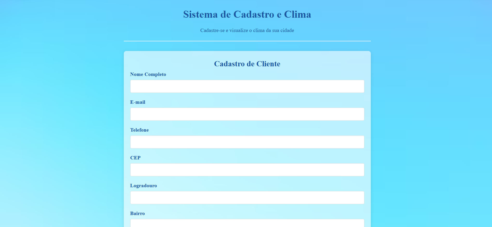
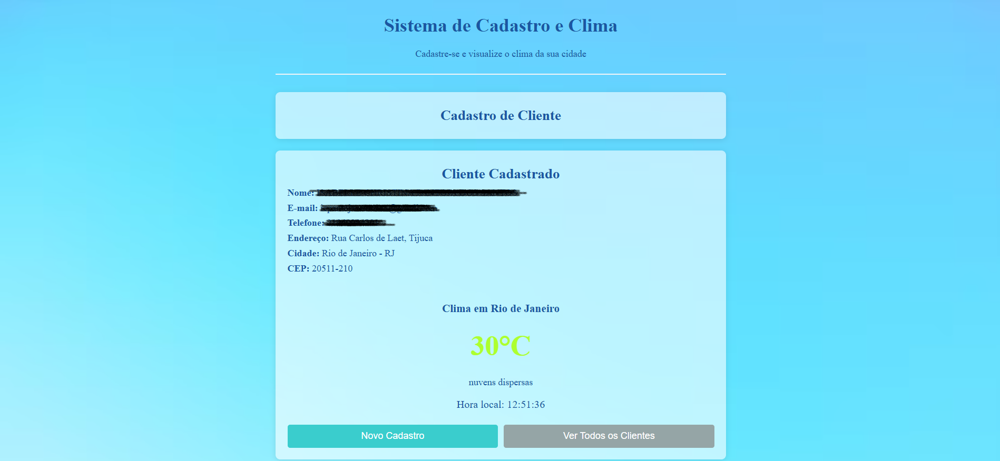

# 🌦️ Sistema de Cadastro e Monitoramento Climático

> Projeto desenvolvido para praticar a integração entre formulários front-end e APIs externas (CEP e Clima).

## 💻 Sobre o Projeto

Esta é uma aplicação web interativa que simula um sistema de cadastro de clientes. O grande diferencial é a automação e integração de dados: ao preencher o endereço e salvar, o sistema consulta APIs externas para trazer informações geográficas e a previsão do tempo em tempo real para a cidade do cliente.

## 📸 Screenshots

  
  

## ✨ Funcionalidades

* **Autopreenchimento de Endereço:** O usuário digita o CEP e o sistema preenche automaticamente rua, bairro, cidade e estado (Integração com API de CEP).
* **Cadastro de Cliente:** Validação e armazenamento dos dados do formulário.
* **Integração Climática:** Após o cadastro, o sistema exibe o clima atual da cidade do cliente.
* **Feedback Visual:** Indicadores de carregamento (loading) enquanto as requisições são feitas.
* **Listagem:** Visualização de todos os clientes cadastrados no sistema.

## 🎨 Layout

O projeto possui uma interface limpa e responsiva, dividida em três seções principais:
1.  **Formulário:** Campos de entrada de dados pessoais e endereço.
2.  **Card de Resultado:** Resumo do cadastro e widget de clima.
3.  **Lista de Clientes:** Histórico de cadastros realizados.

---

## 🚀 Tecnologias e Conceitos Aplicados

* **HTML5 Semântico:** Estruturação correta de formulários e seções.
* **CSS3:** Estilização do layout e classes utilitárias (ex: `.oculto`).
* **JavaScript (ES6+):**
    * Manipulação do DOM.
    * Eventos de formulário (`submit`, `click`, `blur`).
    * Consumo de APIs com `fetch` / `async` e `await`.
    * Tratamento de dados JSON.

## 🔌 APIs Utilizadas (Exemplos)

* **ViaCEP:** Para busca automática de endereço.
* **OpenWeatherMap (ou similar):** Para obtenção dos dados climáticos.

---

## 📂 Como executar o projeto

1.  Clone este repositório ou baixe os arquivos.
2.  Abra o arquivo `index.html` no seu navegador.
3.  **Teste a funcionalidade:**
    * Digite um CEP válido.
    * Preencha os dados restantes.
    * Clique em "Cadastrar" para ver a mágica do clima acontecer!

## 👩‍💻 Autora

**Isabelle Pantoja**

---
*Projeto desenvolvido para fins de estudo e composição de portfólio.* 🚀
